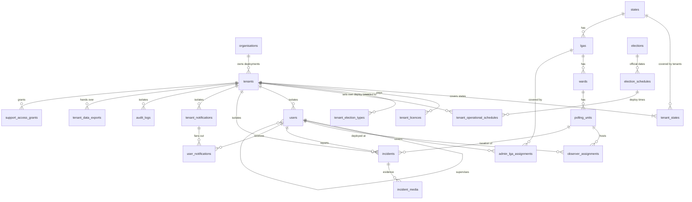

# EIP — Consolidated Master Implementation Plan (v3)

> **Document**: Synthesises v1 (session plan) + v2 (EIP_Multi_Tenant_Data_Design_Plan.md) + stated requirements  
> **Platform**: Election Intelligence Platform — Cybernet Systems Limited  
> **Backend**: Laravel 11 · PHP 8.2+ · MySQL 8.0.16+  
> **Status**: Approved for implementation — awaiting "generate migrations" command

---

## 0. What Changed from v1 → v2 → v3

| Topic | v1 (session) | v2 (your file) | v3 (this plan — final) |
|---|---|---|---|
| Tenants per state | 1 | Many (any number of parties + neutral orgs) | **Many** ✅ |
| Roles | 4 | 5 | **5** ✅ |
| Election scheduling | State master admin sets all state elections | cybernet sets ALL official dates; state master admin sets only **operational** deploy times | **Adopted** ✅ |
| Data isolation | `tenant_id` on users only | Composite FKs on every tenant-owned table | **Composite FKs** ✅ |
| User identification | Internal ID only | Human-readable `user_code` (e.g. `APC-KN-OB-00042`) | **user_code** ✅ |
| Email uniqueness | Global unique | Per-tenant unique (no cross-party info leak) | **Per-tenant** ✅ |
| Cybernet data access | Full access | Metadata only; break-glass with `support_access_grants` | **Adopted** ✅ |
| Data lifecycle | Not designed | Export → handover → 30-day → purge | **Adopted** ✅ |
| Migrations | 9 | 24 | **24** ✅ |

---

## 1. Core Principles

1. **The tenant is the isolation wall.** Tenant = one organisation's deployment for one state (or national). All operational data carries a non-null `tenant_id`.
2. **Many parties, one state.** APC · Kano, PDP · Kano and Kano Civic Watch · Kano are three separate tenants. They can observe the same polling unit; neither sees the other's reports.
3. **Official schedules are facts, not opinions.** INEC/SIEC election dates are set once by Cybernet's superadmin and shared across all tenants. Each party's state master admin only controls *their own observers' deployment time* (when to go to the field), not the official election date.
4. **Cybernet staff cannot read party data by default.** Access to incidents, media and observer details requires a time-limited, audited support-access grant from the tenant's master admin.
5. **Same licence fee for everyone.** ₦8,000,000 per state deployment, stored in `platform_settings`, never hard-coded.
6. **Four-layer isolation**: database constraints, application global scope, storage/channel/cache namespacing, automated test suite.

---

## 2. Role Hierarchy

```
CYBERNET SYSTEMS (Platform owner — no tenant)
└── cybernet_superadmin
      • Registers organisations (parties / neutral orgs)
      • Creates tenants, records licences
      • Sets OFFICIAL election schedules (all election types for all states)
      • Creates the first master admin of each tenant
      • Cannot read party incidents/media without a support-access grant

ORGANISATION (e.g. APC, PDP, LP, "Lagos Civic Watch")   type: political_party | neutral
│
├── TENANT — STATE deployment (e.g. "APC · Kano")          scope: state
│     └── state_master_admin      ← created by cybernet_superadmin
│           ├── state_admin       ← created by state_master_admin
│           │     └── [manages assigned LGAs]
│           └── observer          ← created by state_master_admin or state_admin
│                 └── [deployed to assigned polling unit(s)]
│
└── TENANT — NATIONAL deployment (e.g. "LP · National")    scope: national
      └── national_master_admin   ← created by cybernet_superadmin
            └── state_master_admin (one per covered state)
                  ├── state_admin
                  └── observer
```

### Role Definitions

| Role slug | Created by | Scope | Key privileges |
|---|---|---|---|
| `cybernet_superadmin` | Seeded | All tenants (metadata only) | Orgs, tenants, licences, official schedules, first master admin, platform health |
| `national_master_admin` | `cybernet_superadmin` | All states in the national tenant | Create state master admins, national dashboard, set deploy times, grant support access |
| `state_master_admin` | `cybernet_superadmin` (state tenant) or `national_master_admin` | One state | Create state admins + observers, assign LGAs and PUs, set deploy times, manage all state incidents |
| `state_admin` | `state_master_admin` | Assigned LGAs (1..n) | View/monitor incidents, view/reassign observers in their LGAs |
| `observer` | `state_master_admin` | Assigned polling unit(s) | Check in, report incidents with evidence, receive countdowns |

> **Mapping from current live roles**:  
> Super Admin → `cybernet_superadmin` | National Admin → `national_master_admin` | State Coordinator → `state_master_admin` | LGA Supervisor → `state_admin` | Observer → `observer`

---

## 3. Data Classification

| Class | Tables | Has `tenant_id`? |
|---|---|---|
| **Platform** | `organisations`, `tenants`, `tenant_states`, `tenant_licences`, `tenant_election_types`, `platform_settings`, `support_access_grants`, `purge_records` | No |
| **Shared reference** | `states`, `lgas`, `wards`, `polling_units`, `elections`, `election_schedules` | No |
| **Tenant-owned** | `users`, `user_code_sequences`, `admin_lga_assignments`, `observer_assignments`, `tenant_operational_schedules`, `incidents`, `incident_media`, `check_ins`, `tenant_notifications`, `user_notifications`, `audit_logs` (tenant rows), `tenant_data_exports` | **Yes — NOT NULL** |

---

## 4. Entity Relationship Overview



---

## 5. Table Specifications (Key Tables)

### 5.1 Platform Tables

#### `organisations`
```sql
id, uuid, name, short_code UNIQUE (APC), type (political_party|neutral),
neutral_category nullable, registration_ref, logo_path,
contact_name, contact_email, contact_phone, status (active|suspended),
created_by → users.id, timestamps
CHECK: (type='neutral') = (neutral_category IS NOT NULL)
```

#### `tenants`
```sql
id, uuid UNIQUE, organisation_id → organisations.id,
scope (state|national), state_id → states.id nullable,
name, slug UNIQUE, code UNIQUE (APC-KN / LP-NG),
status (pending_payment|active|suspended|read_only|exported|purged),
max_admins nullable, max_observers nullable,
engagement_starts_at, engagement_ends_at, data_handed_over_at,
purge_due_at, purged_at, created_by → users.id, timestamps
UNIQUE (organisation_id, scope, COALESCE(state_id, 0))
CHECK: (scope='state') = (state_id IS NOT NULL)
```

#### `tenant_states`
```sql
id, tenant_id → tenants.id, state_id → states.id, timestamps
UNIQUE (tenant_id, state_id)
```

#### `tenant_licences`
```sql
id, tenant_id, election_period, fee_basis (standard_state|national_quote),
licence_fee DECIMAL(14,2), currency DEFAULT 'NGN',
invoice_ref, status (pending|paid|cancelled|expired),
paid_at, valid_from, valid_to, notes, created_by, timestamps
```
> **Rule**: `fee_basis = standard_state` → `licence_fee` must equal `platform_settings.standard_state_licence_fee`. Enforced in `TenantLicenceService`.

#### `tenant_election_types`
```sql
id, tenant_id, election_type ENUM(presidential|governorship|senate|
house_of_reps|state_assembly|chairmanship|councillor), timestamps
UNIQUE (tenant_id, election_type)
```
> Only tenants with a `presidential` row receive presidential countdowns.

#### `platform_settings`
```sql
key VARCHAR(100) PK, value TEXT, updated_by → users.id, updated_at
-- Default: standard_state_licence_fee = 8000000.00
```

#### `support_access_grants`
```sql
id, tenant_id, granted_by (master admin), granted_to (cybernet_superadmin),
reason TEXT, starts_at, expires_at (max 72h), revoked_at, timestamps
```

#### `purge_records`
```sql
id, certificate_number UNIQUE, tenant_uuid, organisation_name, tenant_name,
handed_over_at, purged_at, purged_by → users.id,
row_counts JSON, storage_objects INT, backup_expiry_note, created_at
```

---

### 5.2 Shared Reference Tables

#### `elections`
```sql
id, name, type ENUM(presidential|governorship|senate|house_of_reps|
state_assembly|chairmanship|councillor),
scope ENUM(national|state) GENERATED (presidential→national, else→state),
description, is_active BOOL, timestamps
```

#### `election_schedules`  ← **Base schedule, set ONLY by `cybernet_superadmin`**

This is the **root record** for an election event. Because different states hold the same election type on different days (e.g. INEC staggers governorship elections across states), each state's date is its own row — not a single nationwide row overridden per-state. Presidential elections have one nationwide row (`state_id = NULL`).

```sql
id, election_id → elections.id,
state_id → states.id nullable     -- NULL = nationwide (presidential only)
title VARCHAR(255)                -- "Kano Governorship Election 2027"
starts_at DATETIME UTC            -- official polls-open
ends_at   DATETIME UTC            -- official polls-close
accreditation_starts_at DATETIME nullable
status ENUM(scheduled|active|closed|postponed|cancelled) DEFAULT 'scheduled'
postponed_from DATETIME nullable  -- original starts_at before latest postponement
status_reason TEXT nullable
set_by → users.id                 -- cybernet_superadmin only
timestamps

INDEX (election_id, state_id)
-- Presidential: one row (state_id = NULL)
-- State elections: one row per state (state_id = states.id)
```

> **Why one-row-per-state instead of one national row + overrides?**  
> INEC regularly conducts elections in phases (Anambra in Nov, Edo in Sep, etc.). A single "Governorship Election" entry would need cascading overrides for every state. One row per state keeps each state's schedule self-contained and makes postponements a simple status+field update on that row.

---

#### `election_schedule_amendments` ← **NEW — Granular postponements & rescheduling**

When part of an election is postponed or rescheduled (entire state, specific LGA, ward, or polling unit), an amendment record is created. The **base `election_schedules` row is updated** to reflect the new authoritative date; the amendment table stores the **full audit trail** of every change.

This allows:
- State-level postponement (e.g. Kano governorship postponed by 2 weeks)
- LGA-level postponement (e.g. Nassarawa LGA suspended due to security)
- Ward-level postponement (e.g. Tudun Wada ward rescheduled)
- Polling-unit-level postponement (e.g. PU-007 closed, voting moved to PU-008)

```sql
election_schedule_amendments
  id                      bigint PK
  election_schedule_id    bigint FK → election_schedules.id

  -- Jurisdiction scope of this amendment (NULL = whole schedule/state)
  scope_level             ENUM(state|lga|ward|polling_unit)
  lga_id                  bigint FK → lgas.id nullable           -- required if scope=lga,ward,pu
  ward_id                 bigint FK → wards.id nullable          -- required if scope=ward,pu
  polling_unit_id         bigint FK → polling_units.id nullable  -- required if scope=polling_unit

  -- Amendment type
  amendment_type          ENUM(postponement|reschedule|cancellation|restoration|time_change)

  -- Previous values (snapshot before this change)
  previous_starts_at      datetime nullable
  previous_ends_at        datetime nullable
  previous_status         varchar(30) nullable

  -- New values applied by this amendment
  new_starts_at           datetime nullable  -- NULL if cancellation
  new_ends_at             datetime nullable
  new_status              ENUM(scheduled|postponed|cancelled)

  reason                  text               -- mandatory — logged to audit
  authority_ref           varchar(100) nullable  -- e.g. INEC press release ref / gazette number

  is_active               boolean DEFAULT true   -- false if superseded by a later amendment
  effective_from          datetime               -- when this amendment takes effect (usually now())

  set_by                  bigint FK → users.id   -- cybernet_superadmin only
  created_at
  updated_at

  INDEX (election_schedule_id, scope_level)
  INDEX (election_schedule_id, lga_id)
  INDEX (election_schedule_id, polling_unit_id)
  CHECK: scope_level = 'state'        → lga_id IS NULL AND ward_id IS NULL AND polling_unit_id IS NULL
  CHECK: scope_level = 'lga'          → lga_id IS NOT NULL AND ward_id IS NULL AND polling_unit_id IS NULL
  CHECK: scope_level = 'ward'         → lga_id IS NOT NULL AND ward_id IS NOT NULL AND polling_unit_id IS NULL
  CHECK: scope_level = 'polling_unit' → polling_unit_id IS NOT NULL
```

**How the effective schedule is resolved for any observer:**
```
function effectiveScheduleFor(observer):
  base = election_schedules where id = observer.election_schedule_id

  // Check for active amendments, most specific wins
  amendments = election_schedule_amendments
    WHERE election_schedule_id = base.id
      AND is_active = true
    ORDER BY scope_level DESC  -- polling_unit > ward > lga > state

  for each amendment:
    if amendment.polling_unit_id = observer.polling_unit_id  → return amendment (most specific)
    if amendment.ward_id = observer.ward.id                  → return amendment
    if amendment.lga_id = observer.lga.id                    → return amendment
    if amendment.scope_level = 'state'                       → return amendment

  return base  // no amendment; original schedule stands
```

> **Specificity rule**: a polling-unit amendment overrides a ward amendment, which overrides an LGA amendment, which overrides a state amendment. The most specific active amendment wins.

---

#### `election_schedule_views` ← Computed/materialised view (optional)

For performance, a read-model can be maintained that pre-resolves the effective schedule for each observer assignment. Rebuilt by a job whenever an amendment is created. Not a migration requirement — implement if query load justifies it.

---

### 5.3 Tenant-Owned Tables (all carry `tenant_id NOT NULL`)

#### `users` — expanded from existing
```sql
-- EXISTING columns kept: id, name, email, password, phone, device_id,
--                        state_id, status, last_login_at, timestamps
-- NEW columns:
organisation_id → organisations.id nullable (NULL only for cybernet_superadmin)
tenant_id → tenants.id nullable           (NULL only for cybernet_superadmin)
user_code VARCHAR(30) UNIQUE nullable
role_type ENUM(cybernet_superadmin|national_master_admin|state_master_admin|state_admin|observer)
supervisor_id → users.id nullable         (reporting line; same tenant enforced)
created_by → users.id nullable
nin_encrypted TEXT nullable               (Laravel 'encrypted' cast)
nin_hash CHAR(64) nullable                (HMAC-SHA256 — for per-tenant uniqueness check)
profile_photo_path VARCHAR(255) nullable
deployment_status ENUM(deployed|standby|off_duty) DEFAULT 'standby'

-- MODIFY:
email UNIQUE  →  UNIQUE(tenant_id, email)  (same person may work for 2 parties)

-- ADD CONSTRAINTS:
UNIQUE (tenant_id, id)                    -- target for composite FKs on child tables
UNIQUE (tenant_id, nin_hash)
FK (tenant_id, supervisor_id) → users(tenant_id, id)
CHECK: (role_type='cybernet_superadmin') = (tenant_id IS NULL)
```

#### `user_code_sequences`
```sql
tenant_id, scope_key (OB|SA|SM|KD-SM...), next_value INT DEFAULT 1
PRIMARY KEY (tenant_id, scope_key)
-- Incremented under row lock; prevents duplicate user codes
```

**User code format**: `{ORG}-{STATE}-{ROLE}-{SEQ}`
- `APC-KN-OB-00042` → APC · Kano · Observer #42
- `APC-KN-SA-004` → APC · Kano · State Admin #4
- `LP-NG-KD-SM-001` → LP · National · Kaduna · State Master Admin #1

#### `admin_lga_assignments`
```sql
id, tenant_id NOT NULL, user_id (must be state_admin),
lga_id → lgas.id, assigned_by (state_master_admin),
is_active BOOL DEFAULT true, assigned_at, timestamps
UNIQUE (tenant_id, user_id, lga_id)
FK (tenant_id, user_id) → users(tenant_id, id)
FK (tenant_id, assigned_by) → users(tenant_id, id)
```

#### `observer_assignments` — expanded from existing
```sql
id, tenant_id NOT NULL, observer_id, polling_unit_id → polling_units.id,
election_schedule_id → election_schedules.id nullable,
assigned_by, status ENUM(active|recalled|completed), assigned_at, timestamps
FK (tenant_id, observer_id) → users(tenant_id, id)
FK (tenant_id, assigned_by) → users(tenant_id, id)
UNIQUE (tenant_id, observer_id, polling_unit_id, election_schedule_id)
```

#### `tenant_operational_schedules` ← **Set by `state_master_admin` (or `national_master_admin`)**
```sql
id, tenant_id NOT NULL, election_schedule_id → election_schedules.id,
state_id → states.id nullable (per-state in national tenants),
deploy_at DATETIME UTC,       -- "DEPLOY NOW" alert time
first_report_due_at DATETIME nullable,
briefing_notes TEXT nullable, set_by, timestamps
UNIQUE (tenant_id, election_schedule_id, state_id)
FK (tenant_id, set_by) → users(tenant_id, id)
```

> **Critical distinction**:  
> `election_schedules` = official INEC/SIEC date → Cybernet only  
> `tenant_operational_schedules` = party's field deployment time → state master admin

#### `incidents` — expanded from existing
```sql
id (bigint), uuid CHAR(36) UNIQUE (device-generated, for offline sync idempotency),
tenant_id NOT NULL, reporter_id, polling_unit_id → polling_units.id,
election_schedule_id nullable, category VARCHAR(50), severity ENUM(low|medium|high|critical),
description TEXT, latitude DECIMAL(10,7), longitude DECIMAL(10,7),
location_accuracy_m DECIMAL(8,2), captured_at, synced_at,
verification_status ENUM(unverified|verified|rejected),
status ENUM(open|investigating|escalated|resolved|closed),
reviewed_by nullable, timestamps, soft_deletes
FK (tenant_id, reporter_id) → users(tenant_id, id)
INDEX (tenant_id, status, severity), INDEX (tenant_id, polling_unit_id)
```

#### `incident_media` — from existing, add tenant_id
```sql
id (bigint), tenant_id NOT NULL, incident_id,
storage_path VARCHAR(500) [tenants/{uuid}/incidents/{uuid}/{file}],
mime_type, size_bytes BIGINT, sha256 CHAR(64), timestamps
FK (tenant_id, incident_id) → incidents(tenant_id, id)
```

#### `check_ins` — was `observer_check_ins`, add tenant_id
```sql
id, uuid CHAR(36) UNIQUE, tenant_id NOT NULL, observer_id,
polling_unit_id → polling_units.id, latitude, longitude, accuracy_m,
captured_at, synced_at, created_at
FK (tenant_id, observer_id) → users(tenant_id, id)
```

#### `tenant_notifications` — replaces `election_notifications`
```sql
id, tenant_id NOT NULL, election_schedule_id nullable,
notification_type ENUM(election_scheduled|schedule_changed|reminder_24h|
reminder_1h|deploy_now|polls_open|polls_closed|custom),
recipient_role ENUM(all|state_admins|observers), state_id nullable,
title, body TEXT, scheduled_for DATETIME UTC,
status ENUM(pending|sending|sent|cancelled|failed),
sent_at nullable, timestamps
INDEX (status, scheduled_for)
```

#### `user_notifications` — replaces `notifications` for election-related messages
```sql
id UUID PK, tenant_id NOT NULL, user_id,
tenant_notification_id nullable → tenant_notifications.id,
title, body TEXT, data JSON nullable (starts_at, deploy_at, polling_unit, etc.),
priority ENUM(low|normal|high|critical), read_at nullable, timestamps
FK (tenant_id, user_id) → users(tenant_id, id)
INDEX (tenant_id, user_id, read_at)
```

#### `audit_logs` — append-only
```sql
id, tenant_id nullable (NULL=platform action), actor_id nullable,
actor_code VARCHAR(30), action VARCHAR(100),
subject_type, subject_id, changes JSON, ip_address, user_agent,
created_at  -- NO updated_at; DB user has no UPDATE/DELETE on this table
```

#### `tenant_data_exports`
```sql
id, tenant_id NOT NULL, requested_by,
status ENUM(queued|building|ready|handed_over|confirmed|failed),
archive_checksum CHAR(64), archive_size_bytes BIGINT,
handed_over_to VARCHAR(255), handed_over_at, confirmed_at, timestamps
```

---

## 6. Access Control Matrix

Legend: ✅ allowed · ❌ denied · 🔒 requires active support-access grant

| Action | cybernet_superadmin | national_master_admin | state_master_admin | state_admin | observer |
|---|:---:|:---:|:---:|:---:|:---:|
| Register organisation | ✅ | ❌ | ❌ | ❌ | ❌ |
| Create/suspend tenant, record licence | ✅ | ❌ | ❌ | ❌ | ❌ |
| Set OFFICIAL election schedule (all types) | ✅ | ❌ | ❌ | ❌ | ❌ |
| View platform metadata (tenant list, counts) | ✅ | ❌ | ❌ | ❌ | ❌ |
| Read tenant incidents/media/observer details | 🔒 | ✅ (tenant) | ✅ (own state) | ✅ (own LGAs) | ✅ (own reports) |
| Create first tenant master admin | ✅ | ❌ | ❌ | ❌ | ❌ |
| Create state master admins | ❌ | ✅ (covered states) | ❌ | ❌ | ❌ |
| Create state admins | ❌ | ❌ | ✅ (own state) | ❌ | ❌ |
| Create observers | ❌ | ❌ | ✅ (own state) | ❌ | ❌ |
| Suspend/reactivate users | ✅ (master only) | ✅ (tenant) | ✅ (own state) | ❌ | ❌ |
| Assign LGAs to state admins | ❌ | ❌ | ✅ | ❌ | ❌ |
| Assign observers to polling units | ❌ | ❌ | ✅ | ✅ (own LGAs) | ❌ |
| Set tenant deploy times (operational schedule) | ❌ | ✅ | ✅ (own state) | ❌ | ❌ |
| Review/verify/escalate incidents | ❌ | ✅ | ✅ (own state) | ✅ (own LGAs) | ❌ |
| Report incidents, check in, mark deployed | ❌ | ❌ | ❌ | ❌ | ✅ |
| View live map | ✅ (metadata) | ✅ (tenant) | ✅ (own state) | ✅ (own LGAs) | ❌ |
| Receive election countdown notifications | ❌ | ✅ | ✅ | ✅ | ✅ |
| Grant/revoke support access to Cybernet | ❌ | ✅ | ✅ (state tenants) | ❌ | ❌ |
| Request data export | ✅ (on client instruction) | ✅ | ✅ (state tenants) | ❌ | ❌ |
| Purge tenant (after 30-day window) | ✅ | ❌ | ❌ | ❌ | ❌ |

---

## 7. Election Countdown & Notification Flow

```
━━━━━━━━━━━━━━━━━━━━━━━━━━━━━━━━━━━━━━━━━━━━━━━━━━━━━━━
TRIGGER: New election_schedule created (cybernet_superadmin)
━━━━━━━━━━━━━━━━━━━━━━━━━━━━━━━━━━━━━━━━━━━━━━━━━━━━━━━
cybernet_superadmin creates election_schedule (one row per state per election type)
        │
        ▼
ElectionScheduleCreated event → ResolveEntitledTenantsJob
        │  Selects tenants WHERE:
        │    status = 'active'
        │    AND tenant_election_types contains this election type
        │    AND (schedule.state_id IS NULL OR state_id IN tenant_states)
        │
        └──► For EACH entitled tenant → create tenant_notifications:
               election_scheduled (now)
               reminder_24h       (starts_at − 24h)
               reminder_1h        (starts_at − 1h)
               deploy_now         (tenant.deploy_at, default starts_at − 30m)
               polls_open         (starts_at)
               polls_closed       (ends_at)

━━━━━━━━━━━━━━━━━━━━━━━━━━━━━━━━━━━━━━━━━━━━━━━━━━━━━━━
TRIGGER: election_schedule updated — state-level change
(e.g. entire state's governorship election date shifts)
━━━━━━━━━━━━━━━━━━━━━━━━━━━━━━━━━━━━━━━━━━━━━━━━━━━━━━━
1. Cybernet creates election_schedule_amendment (scope_level = 'state')
2. Base election_schedule.starts_at / ends_at / status updated to match
3. ElectionScheduleAmended event fired
        │
        └──► For EACH entitled tenant:
               Cancel all pending tenant_notifications for this schedule
               Regenerate full set from the NEW starts_at / ends_at
               Add: schedule_changed notification (now, high priority)
               → All observers in this state receive:
                 "Election rescheduled: {title} now on {new_date}"

━━━━━━━━━━━━━━━━━━━━━━━━━━━━━━━━━━━━━━━━━━━━━━━━━━━━━━━
TRIGGER: Sub-state amendment (LGA / ward / polling-unit postponement)
(e.g. Nassarawa LGA suspended due to security incident)
━━━━━━━━━━━━━━━━━━━━━━━━━━━━━━━━━━━━━━━━━━━━━━━━━━━━━━━
1. Cybernet creates election_schedule_amendment (scope_level = 'lga'|'ward'|'polling_unit')
2. Base election_schedule row is NOT changed (rest of state unaffected)
3. ElectionScheduleAmended event fired
        │
        └──► Identify affected observers:
               SELECT observer_assignments WHERE election_schedule_id = X
                 AND polling_unit_id IN (PUs within the amended jurisdiction)
             For EACH affected tenant → for EACH affected observer:
               Cancel their pending notifications for this schedule
               Create: schedule_changed notification targeted at ONLY those observers
               If amendment_type = cancellation:
                 Create: "Your polling unit / LGA election has been cancelled — await further instruction"
               If amendment_type = postponement:
                 Create: reminders from the NEW new_starts_at
             Unaffected observers in the same state receive NO change notification

━━━━━━━━━━━━━━━━━━━━━━━━━━━━━━━━━━━━━━━━━━━━━━━━━━━━━━━
TRIGGER: tenant deploy_at changed by state_master_admin
━━━━━━━━━━━━━━━━━━━━━━━━━━━━━━━━━━━━━━━━━━━━━━━━━━━━━━━
Only that tenant's deploy_now notification is cancelled and regenerated.
No amendment record needed (deploy_at is operational, not official).

Scheduler (every minute): DispatchDueTenantNotifications
    • SELECT WHERE status='pending' AND scheduled_for <= now() FOR UPDATE SKIP LOCKED
    • Mark 'sending' → fan out to user_notifications (batch chunks of 1,000)
    • Broadcast on private channel: tenant.{uuid}.user.{user_id}
    • Mark 'sent' (or 'failed' + retry)
```

### Frontend Countdown Logic (Observer Dashboard / Header)

```
GET /api/v1/observer/next-election
→ {
    schedule: {
      title, starts_at, ends_at, status,
      amendment: {             ← present if a sub-state amendment affects this observer
        scope_level,           -- "lga" | "ward" | "polling_unit"
        amendment_type,        -- "postponement" | "cancellation" | "reschedule"
        new_starts_at,
        new_ends_at,
        reason
      } | null
    },
    tenant:   { deploy_at },
    assignment: { polling_unit },
    server_time   ← countdown uses server clock offset, NOT device clock
  }

-- Effective starts_at = amendment.new_starts_at ?? schedule.starts_at
-- Effective status    = amendment.new_status    ?? schedule.status

now < deploy_at              → "Election starts in X days HH:MM:SS"
deploy_at ≤ now < eff_starts → "⚠ DEPLOY NOW — go to {polling_unit_name}"
eff_starts ≤ now < eff_ends  → "🗳 POLLS OPEN — Election in Progress" (pulse)
now ≥ eff_ends               → "Polls Closed"
schedule.status = postponed  → "Postponed — new date {new_starts_at}"
amendment.type = cancellation→ "⚠ Election cancelled at this location — await instruction"
```

> Last response is cached on device so countdown works **offline**.

---

## 8. Migration Execution Order (24 migrations)

### Phase 1 — Platform Foundation
| # | Migration | Description |
|---|---|---|
| M01 | `2026_09_27_010001_create_organisations_table` | Party / neutral org registry |
| M02 | `2026_09_27_010002_create_tenants_table` | State + national deployments |
| M03 | `2026_09_27_010003_create_tenant_states_table` | Which states each tenant covers |
| M04 | `2026_09_27_010004_create_tenant_licences_table` | Licence payment records |
| M05 | `2026_09_27_010005_create_tenant_election_types_table` | Which election types each tenant is entitled to |
| M06 | `2026_09_27_010006_create_platform_settings_table` | Key/value config (licence fee, etc.) |
| M07 | `2026_09_27_010007_create_support_access_grants_table` | Break-glass Cybernet access |
| M08 | `2026_09_27_010008_create_purge_records_table` | Deletion certificates |

### Phase 2 — Official Elections (Shared Reference)
| # | Migration | Description |
|---|---|---|
| M09 | `2026_09_27_010009_create_elections_table` | Election type catalogue (one row per type) |
| M10 | `2026_09_27_010010_create_election_schedules_table` | Official INEC/SIEC dates — **one row per state per type** |
| M10b | `2026_09_27_010010b_create_election_schedule_amendments_table` | Granular postponements/rescheduling at state/LGA/ward/PU level |

### Phase 3 — Users (Expand → Backfill → Enforce)
| # | Migration | Description |
|---|---|---|
| M11 | `2026_09_27_010011_expand_users_for_tenancy` | Add all new columns (all NULLABLE) |
| M12 | `2026_09_27_010012_backfill_users_tenancy` | Move existing users into legacy tenant, map roles, generate user_codes |
| M13 | `2026_09_27_010013_enforce_users_tenancy_constraints` | Add NOT NULL, UNIQUE(tenant_id,id), UNIQUE(tenant_id,email), CHECK |
| M14 | `2026_09_27_010014_create_user_code_sequences_table` | Code sequence counters |

### Phase 4 — Jurisdiction & Assignments
| # | Migration | Description |
|---|---|---|
| M15 | `2026_09_27_010015_create_admin_lga_assignments_table` | LGA jurisdiction for state_admins |
| M16 | `2026_09_27_010016_rebuild_observer_assignments_for_tenancy` | Add tenant_id + composite FKs to observer_assignments |
| M17 | `2026_09_27_010017_create_tenant_operational_schedules_table` | Party-specific deploy times |

### Phase 5 — Operational Data
| # | Migration | Description |
|---|---|---|
| M18 | `2026_09_27_010018_add_tenant_to_incidents` | Backfill tenant_id, add composite FKs |
| M19 | `2026_09_27_010019_create_incident_media_table` | Evidence files (replaces old incident_media) |
| M20 | `2026_09_27_010020_add_tenant_to_check_ins` | Backfill tenant_id on observer_check_ins → rename check_ins |

### Phase 6 — Notifications, Audit & Lifecycle
| # | Migration | Description |
|---|---|---|
| M21 | `2026_09_27_010021_create_tenant_notifications_table` | Scheduled broadcast notification queue |
| M22 | `2026_09_27_010022_create_user_notifications_table` | Per-user election notification inbox |
| M23 | `2026_09_27_010023_create_audit_logs_table` | Append-only audit trail |
| M24 | `2026_09_27_010024_create_tenant_data_exports_table` | Data export/handover lifecycle |

> **M12 (backfill)**: Creates a `Legacy / Demo` organisation and tenant and moves all current demo users, incidents and assignments into it, so nothing is left without a `tenant_id`.  
> **Every migration must have a tested `down()`.**

---

## 9. Seeding Plan

```
DatabaseSeeder (production-safe)
  1. CybernetAdminSeeder        → 1 cybernet_superadmin user
  2. PlatformSettingsSeeder     → standard_state_licence_fee = 8000000.00 NGN
  3. StatesSeeder               → 37 records from states-and-lgas JSON
  4. LgasWardsPollingUnitsSeeder→ from existing JSON file
  5. ElectionTypesSeeder        → 7 election types
  6. RolesPermissionsSeeder     → 5 roles + permissions using Spatie (teams = tenant_id)

DemoSeeder (LOCAL / STAGING only — guarded by App::environment())
  Organisations: APC (party), PDP (party), LP (party), Lagos Civic Watch (neutral)
  Tenants:
    APC · Lagos    (state)     → 1 SM, 2 SA, 5 OB, 10 incidents
    PDP · Lagos    (state)     → 1 SM, 2 SA, 5 OB, 10 incidents  ← same PUs as APC
    CVW · Lagos    (state)     → 1 SM, 1 SA, 3 OB, 5 incidents
    LP  · National (national)  → 1 NM, Lagos+Kaduna, 1 SM each, 1 SA each, 3 OB each
  Licences: all paid at standard fee (LP: national quote)
  Official schedules: 1 presidential, 1 Lagos governorship
```

> Demo puts **three tenants on the same polling units** — this is the fixture the isolation test suite runs against.

---

## 10. Laravel Architecture

### Models

| Model | Scoped? | Key Relationships |
|---|:---:|---|
| `Organisation` | No | `hasMany(Tenant)` |
| `Tenant` | No | `belongsTo(Organisation)`, `belongsToMany(State)` via `tenant_states`, `hasMany(User)`, `hasMany(TenantLicence)` |
| `TenantLicence`, `TenantElectionType`, `SupportAccessGrant`, `PurgeRecord`, `PlatformSetting` | No | `belongsTo(Tenant)` |
| `Election`, `ElectionSchedule` | No | Shared reference |
| `User` | Yes* | `belongsTo(Tenant)`, `belongsTo(Organisation)`, `belongsTo(User,'supervisor_id')`, `hasMany(AdminLgaAssignment)`, `hasMany(ObserverAssignment)` |
| `AdminLgaAssignment`, `ObserverAssignment`, `TenantOperationalSchedule`, `Incident`, `IncidentMedia`, `CheckIn`, `TenantNotification`, `UserNotification`, `TenantDataExport`, `AuditLog` | Yes | `belongsTo(Tenant)` + domain relations |

### Core Services & Classes

| Class | Purpose |
|---|---|
| `App\Tenancy\TenantContext` | Holds current tenant; `runAsPlatform()` for audited bypass |
| `App\Tenancy\BelongsToTenant` | Trait: global scope + `creating` hook + org consistency check |
| `App\Http\Middleware\ResolveTenantContext` | Sets TenantContext from authenticated user |
| `App\Services\UserCodeGenerator` | Locked sequence increment; format encoding |
| `App\Services\TenantLicenceService` | Uniform fee rule, activation gate |
| `App\Services\TenantProvisioningService` | org → tenant → states → entitlements → master admin |
| `App\Jobs\ResolveEntitledTenantsJob` | Fans out election schedule changes to entitled tenants |
| `App\Console\Commands\DispatchDueTenantNotifications` | Minute scheduler; sends pending notifications |
| `App\Console\Commands\TenantExport` | Builds encrypted archive for data handover |
| `App\Console\Commands\TenantPurge` | Deletes tenant data, writes deletion certificate |

### Policies (one per matrix cell)
`TenantPolicy`, `OrganisationPolicy`, `ElectionSchedulePolicy`, `UserPolicy`, `IncidentPolicy`, `ObserverAssignmentPolicy`, `AdminLgaAssignmentPolicy`, `SupportAccessGrantPolicy`, `TenantDataExportPolicy`

---

## 11. Four-Layer Isolation

| Layer | Mechanism |
|---|---|
| **1. Database** | `tenant_id NOT NULL` on every tenant-owned table; composite FKs `(tenant_id, x_id) → parent(tenant_id, id)`; CHECK constraints |
| **2. Application** | `BelongsToTenant` global scope; scoped route model binding → 404 never 403 for cross-tenant IDs |
| **3. Infrastructure** | Storage paths `tenants/{uuid}/...`; private broadcast channels `tenant.{uuid}.*`; cache prefix `t:{id}:`; jobs restore TenantContext before running |
| **4. Verification** | Isolation test suite runs on every build — fails if ANY cross-tenant read/write/broadcast/file succeeds |

---

## 12. Data Lifecycle

```
Engagement ends → tenant becomes read_only
    ↓
tenant:export {tenant} → encrypted archive + SHA-256 manifest → hard drive
    ↓
Hard drive handed to client → handed_over_at recorded
    ↓
Client confirms satisfaction → confirmed_at set; purge_due_at = +30 days; status = exported
    ↓
After purge_due_at: tenant:purge {tenant} → all rows + storage objects deleted
    ↓
purge_records entry written → deletion certificate issued (no personal data survives)
```

---

## 13. Open Decisions (Resolved)

| # | Question | Resolution |
|---|---|---|
| D1 | Cross-state HQ view for parties with multiple state tenants? | **No.** Cross-state views come only from a national tenant. Keeps isolation boundary simple. |
| D2 | Block same NIN from two rival parties? | **No automatic check.** Would leak info between parties. Revisit on client request. |
| D3 | National + state tenants coexist for same party in same state? | **Yes** — separate tenants, separate data; client decides which to use. |
| D4 | Ward-level supervision needed in v2? | **No.** `state_admin` with LGA scope is sufficient. Add `ward_supervisor` later if required. |

---

## 14. Implementation Checklist

### Phase A — Sign-off
- [ ] Approve this plan
- [ ] Resolve D1–D4 (resolved above; confirm)

### Phase B — Database (M01–M24)
- [ ] Write all 24 migrations each with tested `down()`
- [ ] `migrate:fresh --seed` succeeds on fresh DB
- [ ] Forward migration succeeds on a copy of existing demo data; legacy tenant verified

### Phase C — Tenancy Core
- [ ] `TenantContext`, `BelongsToTenant`, `ResolveTenantContext`
- [ ] Scoped route model binding (404 across tenants)
- [ ] Storage, cache, queue, broadcast namespacing
- [ ] `UserCodeGenerator` with concurrency test

### Phase D — Roles, Policies & Provisioning
- [ ] Spatie with `teams` (team = tenant_id), 5 roles
- [ ] Policies for every matrix row in §6
- [ ] `TenantProvisioningService`, `TenantLicenceService`
- [ ] Support-access grant flow + audit logging

### Phase E — API (`/api/v1`)
- [ ] Auth: login by `user_code` or `workspace + email`
- [ ] Platform endpoints (cybernet_superadmin)
- [ ] Tenant administration endpoints (all roles)
- [ ] Observer endpoints
- [ ] Idempotent offline sync on `uuid`
- [ ] Audit logging on every write
- [ ] API resource documentation

#### Election Schedule API (cybernet_superadmin only)

```
-- Create / list base schedules
GET  /api/v1/platform/election-schedules
       ?election_type=governorship&state_id=12&status=scheduled
POST /api/v1/platform/election-schedules
     Body: { election_id, state_id, title, starts_at, ends_at, accreditation_starts_at }

-- Read one schedule + its amendments
GET  /api/v1/platform/election-schedules/{id}
       → { schedule, amendments[] }

-- Full update (reschedule) — creates an amendment record, updates the base row
PATCH /api/v1/platform/election-schedules/{id}
      Body: {
        amendment_type: 'reschedule',
        scope_level: 'state',          -- state | lga | ward | polling_unit
        new_starts_at: '...',
        new_ends_at: '...',
        reason: 'INEC press release ref ...',
        authority_ref: 'INEC/PR/2027/041'
      }

-- Postpone (date unknown yet)
PATCH /api/v1/platform/election-schedules/{id}
      Body: {
        amendment_type: 'postponement',
        scope_level: 'lga',
        lga_id: 45,
        reason: 'Security incident — INEC order ref ...'
        -- new_starts_at may be NULL until rescheduled
      }

-- Cancel (specific location or whole schedule)
PATCH /api/v1/platform/election-schedules/{id}
      Body: {
        amendment_type: 'cancellation',
        scope_level: 'polling_unit',
        polling_unit_id: 9214,
        reason: 'Polling unit destroyed; vote moved to PU-9215'
      }

-- Restore after postponement
PATCH /api/v1/platform/election-schedules/{id}
      Body: {
        amendment_type: 'restoration',
        scope_level: 'lga',
        lga_id: 45,
        new_starts_at: '...',
        new_ends_at: '...',
        reason: 'Security situation resolved'
      }

-- Amendment history for a schedule
GET /api/v1/platform/election-schedules/{id}/amendments
    ?scope_level=lga&lga_id=45

-- Service: ElectionScheduleService::amend()
--   1. Validates scope consistency (CHECK rules)
--   2. Marks previous amendment for same scope as is_active = false
--   3. Inserts new amendment_record with previous_* snapshot
--   4. Updates base election_schedule if scope_level = 'state'
--   5. Fires ElectionScheduleAmended event
--   6. Writes audit_log entry
--   7. Returns updated schedule + all active amendments
```

#### Tenant schedule endpoint (read — entitled tenants)
```
GET /api/v1/tenant/election-schedules
    → Each schedule includes its active amendments that affect this tenant's state
GET /api/v1/tenant/election-schedules/{id}
    → Full schedule + amendments filtered to this tenant's jurisdictions
```

#### Observer effective schedule endpoint
```
GET /api/v1/observer/next-election
    → Resolves the most-specific active amendment for the observer's polling unit
    → Returned as schedule.amendment (null if base schedule is unmodified)
```

### Phase F — Notifications & Countdown
- [ ] Entitlement resolution, per-tenant notification rows
- [ ] Minute scheduler dispatcher
- [ ] Postponement regeneration
- [ ] PWA countdown with server-time offset + offline cache

### Phase G — Data Lifecycle
- [ ] `tenant:export` command
- [ ] Handover confirmation flow
- [ ] `tenant:purge` command + deletion certificate

### Phase H — Verification (Isolation Test Suite)
For each tenant pair in demo data (including APC·Lagos vs PDP·Lagos on same polling units):
- [ ] List/show/count/search → own-tenant records only
- [ ] Fetch another tenant's ID → 404
- [ ] Cross-tenant user/incident reference → fails at app AND DB level
- [ ] Cross-tenant media signed URL → rejected
- [ ] Cross-tenant broadcast channel auth → rejected
- [ ] Notifications → never delivered to another tenant
- [ ] Export → contains only exporting tenant's data
- [ ] `cybernet_superadmin` without grant → cannot read incidents/media
- [ ] Purge tenant A → tenant B untouched

---

> **Ready to implement. Say:**
> - **"Generate the migrations"** → produce all 24 migration files
> - **"Generate the tenancy core"** → `TenantContext`, `BelongsToTenant`, middleware, `UserCodeGenerator`
> - **"Generate the models"** → all models with relationships
> - **"Start from Phase B"** → generate everything in Phase B (all 24 migrations + models)
